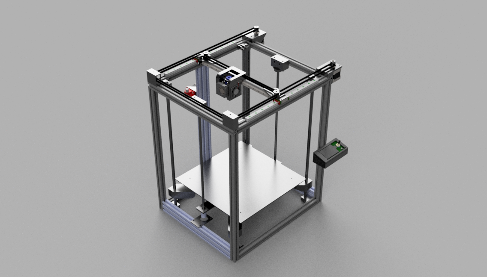
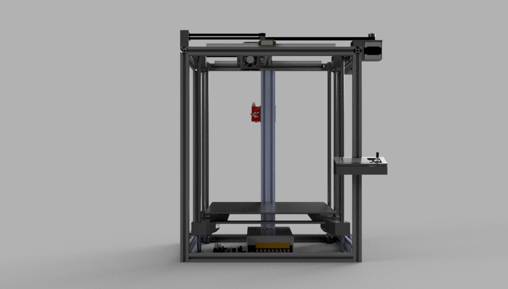
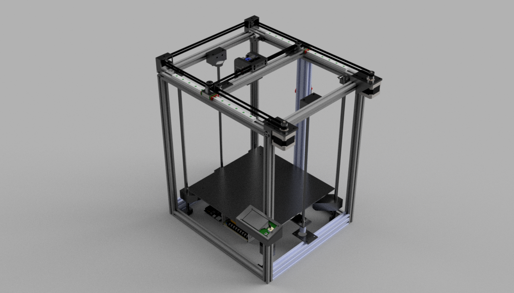
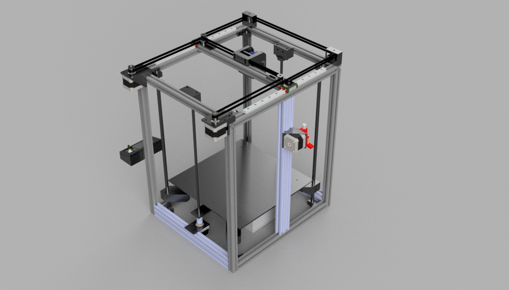
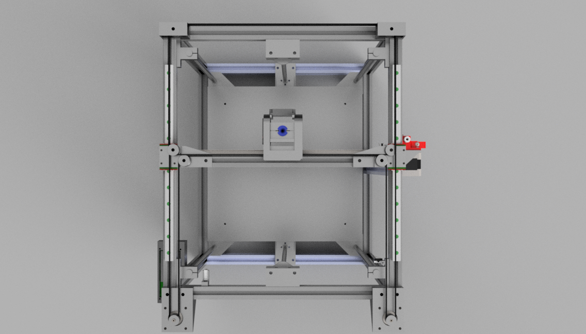
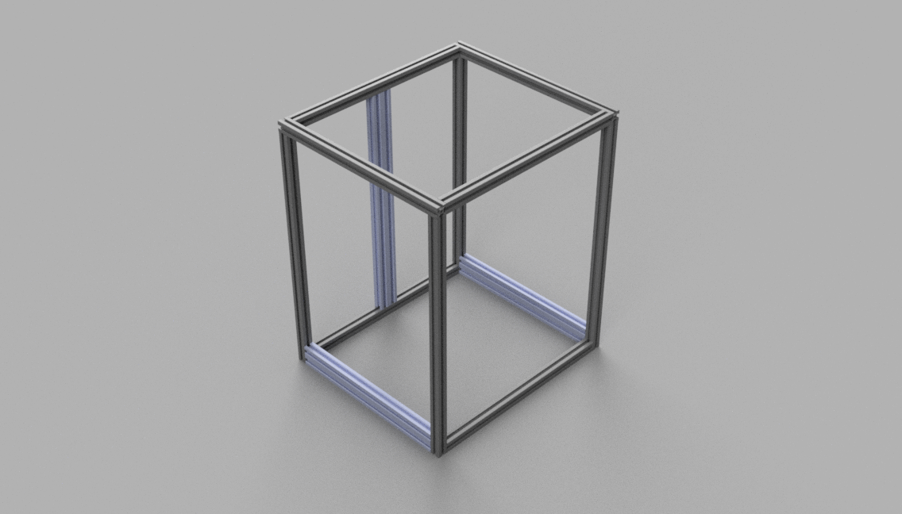
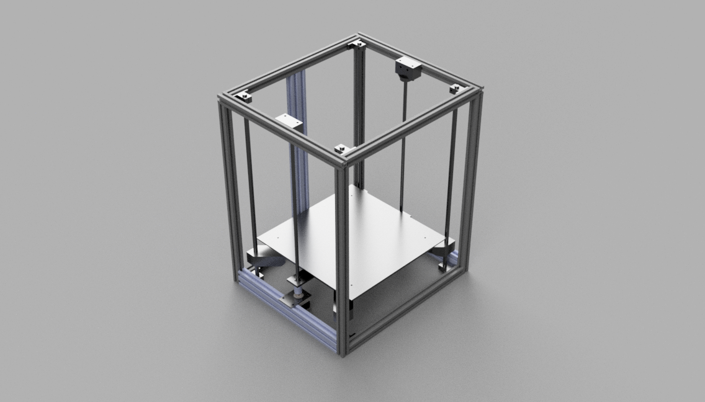
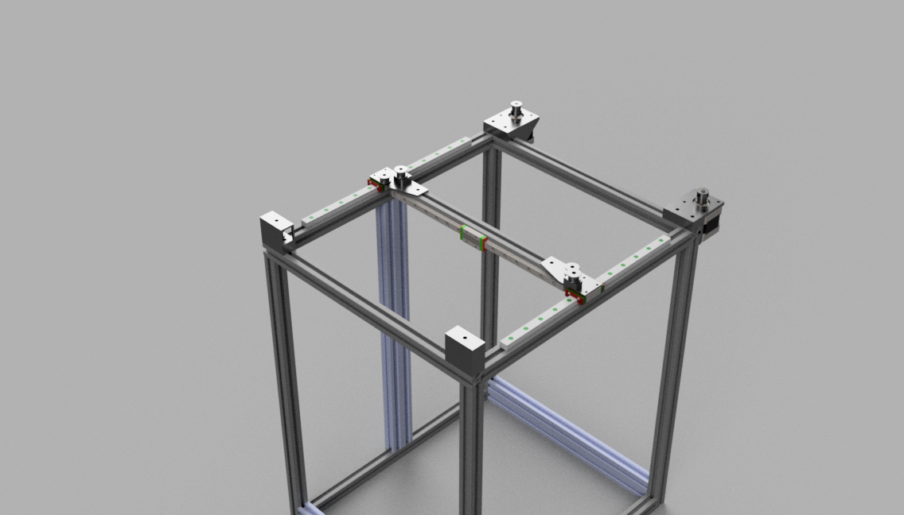
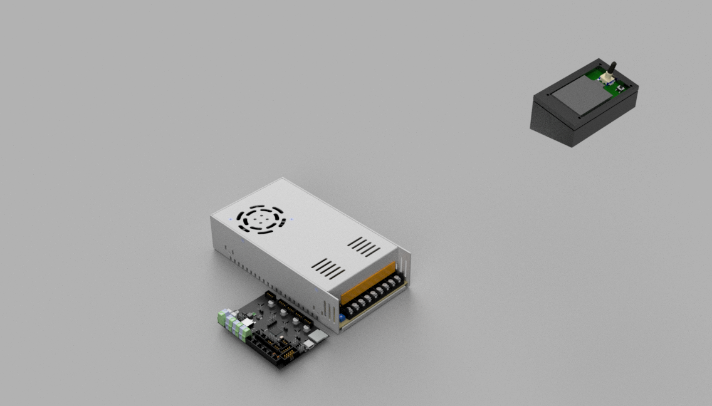

# Yenvo X3

A Custom Large CoreXY 3D Printer having a Print Volume of 36,000 cm³ powered by Bigtreetech SKRat V1.0 and Marling firmware.

My and my friend wanted to print something large without sliccing it, so I decided to make this printer as part of Highway.
This repository contains information related to 3D Printer, including the 3D parts models, firmware, BOM, all models imported into the design.

## Features

- **Faster building** - CoreXY printers are in general faster than Cartesian printers
- **Less space** - Unlike Cartesian printers in which Z-axis moves horizonatally, Z-axis moves vertically so it takes less space
- **Large build area 300x300x400 mm³** - Common printers around this price are mostly 250³ mm³.
- **Easy to maintain and upgrade** - If anything gives wrong just replace that part.
- **Budget friendly** - Only around 300$ can be reduced more if in a metro city by buying parts locally.

### Printer 

### Structure 

### Z-Axis

### XY Linear Rails

### Extruder

### Motherboard, Power Supply and Display

## Bill Of Materials

|Name                                            |Quantity|Price (INR)|Cost (INR)|Cost(USD)|Source                                                                                                 |
|------------------------------------------------|--------|-----------|----------|---------|-------------------------------------------------------------------------------------------------------|
|Nema 17 Stepper Motor                           |5       |459        |2295      |25.245   |https://novo3d.in/nema17-4kgcm/?attribute_torque=4+kgcm+D+shaft+1m+wire                                |
|320mm 2020 Aluminium Profile                    |1       |255        |255       |2.805    |https://novo3d.in/aluminium-profiles-2020/                                                             |
|368mm 2020 Aluminium Profile                    |2       |146        |292       |3.212    |https://novo3d.in/aluminium-profiles-2020/                                                             |
|380mm 2020 Aluminium Profile                    |5       |303        |1515      |16.665   |https://novo3d.in/aluminium-profiles-2020/                                                             |
|480mm 2020 Aluminium Profile                    |4       |380        |1520      |16.72    |https://novo3d.in/aluminium-profiles-2020/                                                             |
|328mm 2040 Aluminium Profile                    |2       |279        |558       |6.138    |https://novo3d.in/aluminium-profile-2040/                                                              |
|460mm 2040 Aluminium Profile                    |1       |391        |391       |4.301    |https://novo3d.in/aluminium-profile-2040/                                                              |
|500mm Smooth Rod                                |4       |219        |876       |9.636    |https://novo3d.in/aluminium-profile-2040/                                                              |
|10mm Linear Motion Bearing                      |4       |48         |192       |2.112    |https://novo3d.in/lm10uu-10mm-bearing/                                                                 |
|Bigtreetech SKRat V1.0                          |1       |3689       |3689      |40.579   |https://novo3d.in/bigtreetech-skrat-v1-0/                                                              |
|Limit Switch                                    |3       |89         |267       |2.937    |https://novo3d.in/limit-switch-vertical/                                                               |
|30cm MGN9H Linear Rail Guide                    |1       |799        |799       |8.789    |https://novo3d.in/mgn9h-linear-rail/?attribute_length=30cm&attribute_block=without+block               |
|30cm MGN12H Linear Rail Guide                   |2       |849        |1698      |18.678   |https://novo3d.in/mgn12h-linear-rail/?attribute_size=30cm&attribute_type=without+block                 |
|MGN9H Linear Rail Block                         |1       |479        |479       |5.269    |https://novo3d.in/linear-guide-rail/?attribute_type=MGN9H                                              |
|MGN12H Linear Rail Block                        |2       |499        |998       |10.978   |https://novo3d.in/linear-guide-rail/?attribute_type=MGN12H                                             |
|Dual Gear Extruder                              |1       |649        |649       |7.139    |https://novo3d.in/dual-gear-extruder/                                                                  |
|Volcano Hotend 0.4mm                            |1       |999        |999       |11.40    |https://novo3d.in/volcano-print-j-head/                                                                |
|Blower Fan                                      |1       |159        |159       |1.749    |https://novo3d.in/cooling-fan-turbo-4010/?attribute_type=12V+with+fan+guide&attribute_wire-length=100cm|
|Cooling Fan                                     |2       |69         |138       |1.518    |https://novo3d.in/cooling-fan/?attribute_voltage=5V+with+100cm+Wire                                    |
|40cm Single Start Threaded Rod                  |2       |299        |598       |6.578    |https://novo3d.in/single-start-lead-screw/?attribute_size=400mm                                        |
|PTFE Tube                                       |1       |89         |89        |0.979    |https://novo3d.in/blue-ptfe/                                                                           |
|Meanwell PowerSupply                            |1       |2499       |2499      |27.489   |https://novo3d.in/mean-well-power-supply/?attribute_voltage=12V+30A                                    |
|Bigtreetech Display V2                          |1       |1099       |1099      |12.089   |https://novo3d.in/bigtreetech-mini-12864-display/                                                      |
|Heatbed 310mm                                   |1       |1799       |1799      |19.789   |https://novo3d.in/heat-bed-310mm/?attribute_voltage=12v&attribute_type=Heat+bed+with+100cm+cable       |
|Heatbed Clip                                    |8       |25         |200       |2.2      |https://novo3d.in/heat-bed-clip/?attribute_type=Class+A                                                |
|Bed Leveling Set                                |1       |159        |159       |1.749    |https://novo3d.in/bed-leveling-nutset/?attribute_type=M4+set+kit                                       |
|Idler Pully 6mm without Teeth                   |2       |65         |130       |1.43     |https://novo3d.in/idler-pulley/?attribute_type=6mm+without+teeth                                       |
|Double Head Pulley                              |4       |61         |244       |2.684    |https://novo3d.in/v-belt-pulley/                                                                       |
|Idler Pully 6mm                                 |2       |69         |138       |1.518    |https://novo3d.in/idler-pulley-6mm/                                                                    |
|6mm Timing Belt                                 |1       |236        |236       |2.596    |https://novo3d.in/gt2-6mm-belt/                                                                        |
|Flexible Coupling 5x8                           |2       |59         |118       |1.298    |https://novo3d.in/flexible-coupling-5x8mm/                                                             |
|Misc. (Screw, Nuts, Connectors, Jointers,  etc.)|1       |2000       |2000      |22       |                                                                                                       |
|Total                                           |        |           |          |298.269  |                                                                                                       |
